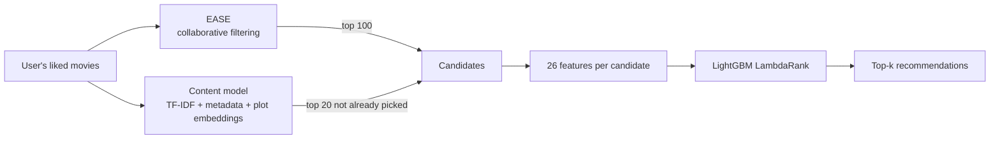

# Movie Recommender

A two-stage movie recommendation system: collaborative filtering and content retrieval generate candidates, and a LightGBM learning-to-rank model orders them. It is trained on **7.9M likes from 199K MovieLens users**, served by a FastAPI backend, and has a React frontend.

Pick a few movies you love from the IMDb Top 1000 and get personalized recommendations in about 15 ms.

| Model (20K held-out users, mean ± std over 3 splits) | NDCG@10 | Recall@10 | Catalog coverage |
|---|---|---|---|
| Popularity baseline | 0.170 ± 0.003 | 0.189 | 5% |
| Content-based (TF-IDF + plot embeddings) | 0.130 ± 0.002 | 0.133 | 49% |
| Collaborative filtering (EASE) | 0.397 ± 0.003 | 0.434 | 67% |
| **Two-stage (EASE + LightGBM reranker)** | **0.406 ± 0.003** | **0.441** | **75%** |

---

## How it works



### The data

- **Catalog:** the [IMDb Top 1000](https://www.kaggle.com/datasets/mayankray/imdb-top-1000-movies-dataset) (title, plot, genres, director, cast, rating, votes). It contains descriptions of movies but no information about who liked what.
- **Behavior:** [MovieLens 32M](https://grouplens.org/datasets/movielens/), 32 million ratings collected from real users on movielens.org by the GroupLens research lab. A rating ≥ 4 counts as a "like".
- **Joining them:** the two datasets share no IDs, and the IMDb file has no release years. So titles are matched by normalized key (articles, accents, `&` vs. `and`, alternate titles), and then by a guarded prefix/suffix match ("The Raid 2" ↔ "The Raid 2: Berandal") that requires the same digits on both sides, so "Vol. 2" can't match the first film. 973 of 1,000 movies match. The 32M ratings are streamed in chunks, filtered to the catalog and cached as a 19 MB `.npz`, so later runs load in 0.2 s.

### Stage 1: candidate generation

**EASE** ([Steck, 2019](https://arxiv.org/abs/1905.03375)) is the core model. It learns a 1000×1000 item-to-item weight matrix `B` by asking each user's like-vector to reconstruct itself (`X ≈ XB`) with no item allowed to predict itself and an L2 penalty on the weights. The problem has a closed-form solution, one matrix inverse, so training takes about a second. Scoring a user is a single product: `scores = likes · B`. This is how it learns relationships that metadata misses, such as *The Dark Knight* → *Inception*.

**Content model.** Each movie becomes a vector made of these blocks:
- TF-IDF of the plot
- bag-of-genres
- whole-name director and cast tokens
- year
- a 384-d sentence embedding of the plot (MiniLM)

Each block is L2-normalized and weighted, and a user's profile is the mean of their liked movies' vectors. This model contributes candidates that EASE wouldn't find, plus similarity features for the reranker.

### Stage 2: learning to rank

For every candidate, the reranker computes 26 features:
- EASE score and rank
- the strongest single EASE link from any liked movie
- co-like cosine similarity
- content similarity: overall, per block, and to the single closest liked movie
- popularity, IMDb rating and votes, MovieLens mean rating and like rate
- release year relative to the user's usual era
- user-level statistics

A **LightGBM LambdaRank** model, which optimizes NDCG directly, is trained on 55K users whose hidden likes serve as labels. About 80% of hidden likes reach the candidate set, which caps what the reranker can recover. The most important features are the EASE rank and score, followed by IMDb votes and user activity.

### Cold start: movies nobody has rated

27 catalog movies aren't in MovieLens (e.g. *Oppenheimer*), and future releases won't be either. Two techniques handle them:

1. **Content-to-collaborative imputation.** An unrated movie's row and column of `B` become a similarity-weighted average of its 25 most content-similar rated movies. Because scoring is linear in `B`, this means "people who'd like this movie are the people who like the movies most like it." Everything downstream treats the movie like any other.
2. **Item-dropout training** (as in [DropoutNet](https://papers.nips.cc/paper/7081-dropoutnet-addressing-cold-start-in-recommender-systems)). A third of the reranker's training queries come from an EASE model with a random 10% of movies hidden, so the reranker learns how to rank movies that have no ratings.

Cold-start benchmark: 100 movies are removed from collaborative training, and each model ranks them for the test users who actually liked one.

| Model | NDCG@10 (mean ± std, 3 splits) |
|---|---|
| IMDb popularity | 0.262 ± 0.041 |
| Content-based | 0.230 ± 0.050 |
| **Two-stage** | **0.295 ± 0.070** |

The two-stage model beats popularity on average, but this benchmark is noisy because only 100 movies are hidden per split. Without item dropout the reranker learned to bury unrated movies, and on the first split it scored below the popularity baseline (0.301 vs. 0.318). With dropout, the same split reached 0.394.

---

## Evaluation methodology

Offline evaluation with strong generalization, i.e. test users are never seen during training:

1. Users are split into three disjoint groups:
   - **train** (120K): EASE learns from these
   - **ranker** (60K): hyperparameter tuning and LightGBM training
   - **test** (20K): used only for the final report
2. For each ranker/test user, 20% of their likes are hidden. The model gets the other 80% as input, like picking favorites in the app.
3. Each model ranks the whole catalog, minus the input likes. **Recall@10** is hidden likes found in the top 10 / min(10, #hidden). **NDCG@10** also rewards ranking them higher. **Coverage** is the share of the catalog that appears in anyone's top 10.
4. The full tune-train-test pipeline is repeated on 3 random splits (`scripts/evaluate.py`), and the tables above report mean ± std.

Item statistics used as features (MovieLens mean rating and like rate) are computed from training users only, so a test user's hidden ratings never leak into their own features. Scoring is fully vectorized (sparse × dense products over batches of 2,048 users), so evaluating 20K users takes seconds.

### What I tried

| Change | Result |
|---|---|
| Content-only → EASE collaborative filtering | NDCG@10 0.13 → 0.40 (3×) |
| Train EASE on all ratings, ratings ≥ 3, or rating-weighted instead of likes only | All slightly worse (−0.3 to −2.6%), so likes only stays |
| Linear blend of EASE + content (tuned α, β) | Tied with EASE alone; content adds no warm-start signal |
| LightGBM reranker over EASE + content candidates | +2.3% NDCG@10 over EASE, coverage 67% → 75% |
| More ranker training queries (20K → 55K) | Lift over EASE grew from +1.6% to +2.2% |
| Plot sentence embeddings in the content model | Cold-start NDCG +6% over TF-IDF-only content |
| Content-to-collaborative imputation for unrated movies | Cold-start NDCG about +30% over content similarity on validation |
| Item-dropout ranker training | Fixed the reranker burying new movies (cold NDCG 0.30 → 0.39 on split 0) |

### Known limitations

- **Release-era bias.** MovieLens users often rated mid-90s films together, so *Toy Story* pulls in *12 Monkeys* and *Apollo 13*. Content-only recommendations look more intuitive for single-movie queries.
- **Offline metrics only.** Hidden-like recall measures how well the model predicts behavior. It doesn't capture novelty or whether users would actually enjoy the recommendations, which needs online testing.
- **Title matching** has no release year to disambiguate with. With duplicate titles (two films called *Scarface*), only the first gets matched (to the more-rated MovieLens movie) and the other is treated as unrated. One known fuzzy mismatch remains (*Bound by Honor*).

---

## Running it

### Docker (everything)

```bash
docker compose up --build
```
- Frontend: http://localhost:3000
- API docs: http://localhost:8000/docs

The trained model is committed in `models/` (about 9 MB), so no training is needed to run the app.

### Local development

```bash
python -m venv .venv && source .venv/bin/activate
pip install -r requirements-dev.txt          # macOS: brew install libomp (for LightGBM)
uvicorn backend.main:app --reload --port 8000

cd frontend && npm install && npm run dev    # second terminal
```

### Training and evaluation

```bash
python -m scripts.train                      # downloads MovieLens 32M (240 MB) once, about 4 min
python -m scripts.evaluate --splits 3        # mean ± std over random user splits, about 11 min
python -m scripts.train --dataset ml-latest-small --quick   # 10 s smoke test (used in CI)
```

`train.py` tunes, trains, prints both benchmarks, and saves the exact evaluated model to `models/` with its hyperparameters, metrics and feature importances in `models/model.json`.

Optional data-refresh scripts:
- `scripts/embed_plots.py` regenerates the plot embeddings (needs `requirements-embeddings.txt`)
- `scripts/fetch_posters.py` fetches TMDB poster URLs
- `scripts/download_imdb.py` re-downloads the catalog

### API

| Endpoint | Description |
|---|---|
| `POST /recommendations` | `{"liked": [movie ids], "k": 1–50}` → ranked movies with a 0–1 match score |
| `GET /titles` | Full catalog for search (ETag-cached) |
| `GET /movie/{id}` | One movie, 404 if unknown |
| `GET /model` | Serving model version, hyperparameters, offline metrics, feature importances |
| `GET /health` | Liveness and which model is loaded |

If `models/` is missing, the API falls back to the content-only model.

---

## Project layout

```
recommender/          ML package
  catalog.py          load + normalize the IMDb catalog
  movielens.py        download, stream, title-match and cache MovieLens ratings
  content.py          content-based model (TF-IDF, metadata, plot embeddings)
  collaborative.py    EASE + cold-start imputation
  hybrid.py           EASE/content blend (used for display scores and baselines)
  ranker.py           candidate generation, 26 features, LightGBM LambdaRank
  evaluation.py       user splits, batched Recall/NDCG/coverage, cold-start benchmark
  model.py            TrainedModel: serving inference + save/load
backend/main.py       FastAPI app
frontend/             React + TanStack Start UI
scripts/              train, evaluate, embed_plots, fetch_posters, download_imdb
tests/                pytest: models, ranker, matching, evaluation, API
models/               trained artifacts + metrics (committed)
```

**Stack:** Python, NumPy/SciPy, scikit-learn, LightGBM, sentence-transformers, FastAPI, React/TypeScript, Docker, GitHub Actions (ruff, pytest, training smoke test, frontend build, Docker build).

---

## Data credits

- F. Maxwell Harper and Joseph A. Konstan. 2015. *The MovieLens Datasets: History and Context.* ACM TiiS 5, 4. MovieLens data is downloaded at training time and not redistributed.
- IMDb Top 1000 dataset by mayankray on Kaggle. Posters from TMDB.
